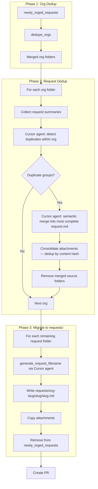

# Combined Org + Request-Level Dedup Workflow

## Overview

A three-phase workflow: (1) org folder merge, (2) request-level semantic dedup within each org using Cursor agent, (3) migrate deduped requests into the canonical `requests/` folder with slug-based filenames. Reuses existing prompts and `cursor_agent_run` where possible.

## Current State

- **[dedupe_newly_orged.py](../scripts/dedupe_newly_orged.py)**: Merges variant org folders (e.g. `summit-institute-מכון-סאמיט` -> `summit-institute`) via `ORG_CANONICAL`. No request-level logic.
- **[deduplicate.py](../scripts/deduplicate.py)**: Request-level dedup for flat `requests/` using Cursor agent. Uses git to find "new" vs "existing" files, [detect-duplicates](../prompts/detect-duplicates.md) and [merge-duplicates](../prompts/merge-duplicates.md) prompts. Outputs merged files into flat `requests/`; creates PRs.
- **newly_orged_requests/** layout: `org-slug/request-slug/request.md` + attachments per request. This is a **one-time staging area** — the final canonical store is `requests/`.
- **requests/** existing files will be discarded — `raw_emails/` will be fully regenerated from scratch, so no migration of old files is needed. Target layout going forward:
  ```
  requests/
  ├── summit-institute/
  │   └── summit-institute-computers/
  │       ├── summit-institute-computers.md
  │       └── <attachments>
  ├── dror-israel/
  │   └── dror-israel-youth-program/
  │       └── ...
  └── unknown/
      └── unknown-fw-how-are-you/
          └── ...
  ```
  Top level = org slug. Second level = request slug (from `generate-filename` prompt, no date prefix). File = `slug.md` (never `request.md`). Dates are stored only inside the request file's frontmatter (`date_received`).

---

## Proposed Workflow



---

## Decisions

| Question | Decision |
|----------|----------|
| Output mechanism | Create a PR (same pattern as `deduplicate.py`) |
| Attachment dedup on merge | Deduplicate by content hash; skip files whose hash already exists in the destination folder |
| Merge strategy | No "keeper" — Cursor agent performs a full semantic merge producing the most complete single document; if the chosen base is missing any information from the others, the agent edits it in |
| File naming | No `request.md` filenames; all files renamed using `generate_request_filename` (same prompt + function as `normalize_requests.py`) during Phase 3 migration |
| Final destination | `requests/org-slug/request-slug/request-slug.md` — no timestamps in folder or file names |

---

## Implementation Plan

### 1. New prompt: `detect-duplicates-within-org.md`

The existing [detect-duplicates.md](../prompts/detect-duplicates.md) requires at least one new and one existing file per group. For within-org dedup all requests are peers — use a different prompt:

- **Input**: JSON array of `{path, org, date_received, body}` for all requests in one org
- **Output**: JSON array of duplicate groups (each group = array of paths); empty array if none
- **Logic**: "Identify groups of requests that are semantically the same ask (same topic, same org)."
- **No-duplicates output**: `[]` (must be stated explicitly in prompt to avoid ambiguous responses)

Expected output schema:
```json
[
  ["org/req-a/request.md", "org/req-b/request.md"],
  ["org/req-c/request.md", "org/req-d/request.md", "org/req-e/request.md"]
]
```

### 2. New script: `dedup_workflow.py`

Orchestrates all three phases.

#### Phase 1 — Org dedup
Import and call `dedupe_orgs(root, dry_run)` from `dedupe_newly_orged`.

#### Phase 2 — Request dedup (within each org)

For each org folder with 2+ request subfolders:

1. Build summaries: `{path, org, date_received, body_excerpt}` — adapt `summarize_file` for `request.md` frontmatter fields (`id`, `source_email_id`, `date_received`); include first 1500 chars of body.
2. Call Cursor agent with `detect-duplicates-within-org` prompt.
3. Parse JSON response; log and skip group on parse failure.
4. For each duplicate group (2+ paths):
   - Call Cursor agent with `merge-duplicates` prompt (reuse existing). The agent must produce the most complete unified `request.md` — combining all unique information and editing content that is present but incomplete in any source.
   - Write merged content into the first folder's `request.md`.
   - Add `merged_from` list to frontmatter (relative paths of all source files).
   - Consolidate attachments: for each file in the other folders, compute SHA-256; copy into the first folder only if no file with that hash already exists. Rename on filename collision (`file.pdf` → `file-1.pdf`).
   - Remove the other request folders (`shutil.rmtree`).

#### Phase 3 — Migrate to `requests/`

For each remaining request folder in `newly_orged_requests/`:

1. Read `request.md`; extract `org` and `summary` for filename generation.
2. Call `generate_request_filename(req)` (import from `normalize_requests` or inline the same logic).
3. Derive org slug from the parent folder name in `newly_orged_requests/`.
4. Write `requests/org-slug/slug/slug.md` — no date in folder or filename; date is preserved only in frontmatter (handle slug collisions with `-1`, `-2` suffix).
6. Copy attachments (all non-`request.md` files) into the same folder.
7. Remove the source folder from `newly_orged_requests/`.

After all three phases: create a PR branch, commit all changes, push, open PR via `gh_pr_create`.

### 3. Update `normalize_requests.py` — new folder structure

`process_folder()` currently writes to `requests/YYYY-MM-DD/slug/slug.md`. Change to match the new layout.

**Current (line ~401):**
```python
out_dir = os.path.join(REQUESTS_DIR, today, out_slug)
out_path = os.path.join(out_dir, f"{out_slug}.md")
```

**New:**
```python
org_slug = make_slug("", req.get("organization", "unknown"), include_date=False)
out_dir = os.path.join(REQUESTS_DIR, org_slug, out_slug)
out_path = os.path.join(out_dir, f"{out_slug}.md")
```

No date prefix in folder or filename — dates are stored only in frontmatter (`date_received`).

Collision handling (if `out_dir` already exists): append `-1`, `-2` to `out_slug` before creating the folder.

> **Note:** `raw_emails/` retains its timestamp-based structure (`raw_emails/<timestamp>/<email-slug>/`) and is never pre-organized by org. The org slug written to `requests/` is derived solely from the `organization` field extracted by the Cursor agent during normalization — not from any folder structure in `raw_emails/`.

Result: `requests/summit-institute/summit-institute-computers/summit-institute-computers.md`

### 4. Export `dedupe_orgs` from `dedupe_newly_orged.py`

`dedupe_orgs(root, dry_run)` is already a clean function — no structural change needed. Import directly.

### 5. Reuse `generate_request_filename` from `normalize_requests.py`

Import the function directly (or extract to `utils.py` if both scripts need it). Uses the same `generate-filename.md` prompt and Cursor agent call.

### 6. CLI interface

```bash
uv run python scripts/dedup_workflow.py                    # Run all three phases
uv run python scripts/dedup_workflow.py --phase orgs       # Phase 1 only
uv run python scripts/dedup_workflow.py --phase requests   # Phase 2 only (assumes Phase 1 done)
uv run python scripts/dedup_workflow.py --phase migrate    # Phase 3 only
uv run python scripts/dedup_workflow.py --dry-run
```

---

## Files to Create/Modify

| File | Action |
|------|--------|
| `prompts/detect-duplicates-within-org.md` | New — within-org duplicate detection prompt |
| `scripts/dedup_workflow.py` | New — orchestrator for all three phases |
| `scripts/dedupe_newly_orged.py` | No change (already exports `dedupe_orgs`) |
| `scripts/normalize_requests.py` | **Required**: update `process_folder()` to write `requests/org-slug/slug/slug.md` (no timestamps in paths); export `generate_request_filename` for reuse in Phase 3 |

---

## Edge Cases

- **Single request per org**: Skip Cursor agent call for that org in Phase 2; still migrate in Phase 3.
- **No duplicates found**: Leave org as-is; proceed to Phase 3.
- **Prompt parse failure**: Log and skip group; continue with remaining groups.
- **Slug collision in `requests/org-slug/`**: Append `-1`, `-2`, etc. to the request slug.
- **`CURSOR_API_KEY`**: Required for Phases 2 and 3; Phase 1 works without it.
- **Attachment hash collision**: Two files with the same hash → keep one copy, discard the other silently.
- **Post-merge folder naming**: The first folder in the group is retained as-is (internal slug doesn't matter; Phase 3 will rename via title extractor).
