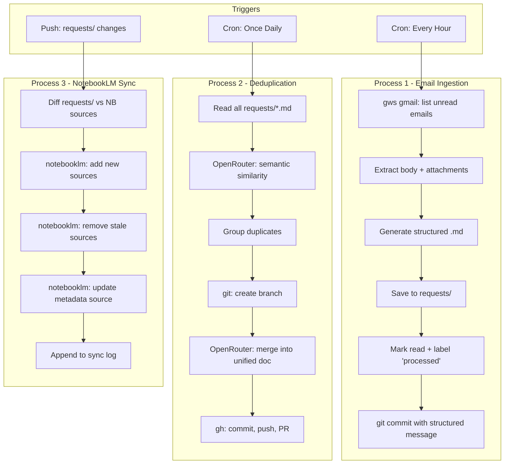

# Requests Buddy Implementation Plan

## Architecture Overview

## Two-Phase Operation Model

### Phase 1: Interactive First-Time Setup (Human, Local)

A one-time setup script (`scripts/setup.sh`) that a human runs locally. It handles all interactive authentication flows that require a browser:

1. **Gmail auth** - `gws auth login -s gmail` (opens browser). Exports credentials to `.secrets/gws-credentials.json`.
2. **NotebookLM auth** - `notebooklm login` (opens browser). Copies credentials to `.secrets/notebooklm-credentials/`.
3. **OpenRouter API key** - Prompts user to paste, saves to `.secrets/openrouter-api-key`.
4. **NotebookLM notebook ID** - Prompts user to paste, saves to `.secrets/notebooklm-notebook-id`.
5. **Upload secrets** - Runs `scripts/upload-secrets.sh` to push `.secrets/` contents to GitHub Actions secrets.
6. **Create Gmail "processed" label** - Ensures the label exists via `gws`.
7. **Initial push** - Pushes to `origin main`.

### Phase 2: Headless CI Operation (Unattended, GitHub Actions)

After setup, all three processes run fully unattended. Credentials are restored from GitHub secrets at workflow start.

## Process 1: Email Ingestion (Hourly)

- **Workflow:** `.github/workflows/ingest-emails.yml` | **Script:** `scripts/ingest_emails.py`
- Lists unread emails via `gws gmail` (query: `is:unread -label:processed`)
- Extracts content + attachments, generates structured Markdown in `requests/`
- Marks emails as read + adds `processed` label
- Commits each email with structured message (serves as audit log), pushes to `main`

## Process 2: Deduplication (Daily)

- **Workflow:** `.github/workflows/deduplicate.yml` | **Script:** `scripts/deduplicate.py`
- Identifies new files since last dedup run (via `logs/last-dedup-marker`)
- Compares new files against existing ones using OpenRouter LLM for semantic similarity
- Merges duplicate groups into unified documents on a `dedup/` branch
- Creates a PR for human review

## Process 3: NotebookLM Sync (On Push)

- **Workflow:** `.github/workflows/sync-notebooklm.yml` | **Script:** `scripts/sync_notebooklm.py`
- Triggered on push to `main` affecting `requests/**`
- Diffs `requests/` files against NotebookLM sources (tracked via `logs/notebooklm-sources.json`)
- Adds new sources, removes stale ones, updates a metadata source with sync timestamp
- Logs changes to `logs/notebooklm-sync.log`

## Secrets Required

| Secret | Source |
|--------|--------|
| `GWS_CREDENTIALS` | `gws auth export --unmasked` |
| `OPENROUTER_API_KEY` | OpenRouter dashboard |
| `NOTEBOOKLM_CREDENTIALS` | `~/.notebooklm/` (tar + base64) |
| `NOTEBOOKLM_NOTEBOOK_ID` | NotebookLM notebook URL |
